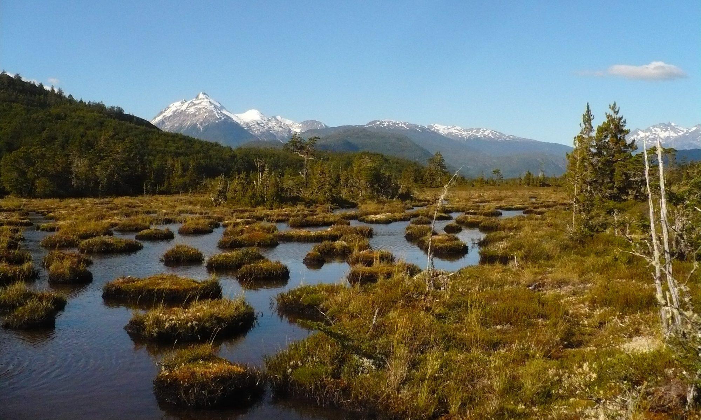

# Preface {.unnumbered}

Este documento tiene como objetivo inicial ir registrando los avances en el proceso de experimentación de la Tesis de Master of Data Science de la Universidad Adolfo Ibáñez.

Se pretende un sistema sistema de detección de cambio secuencia a diferente nivles.

1. Detección de diferencias con imágenes tipo radar Sentinel S1
2. Clasificación Tipo de cambio (Forestal, Turberas, Humedales, etc.) Sentinel S2
3. ~~Segmentación Semántica para identificar pertubacionales y poligonizar~~

