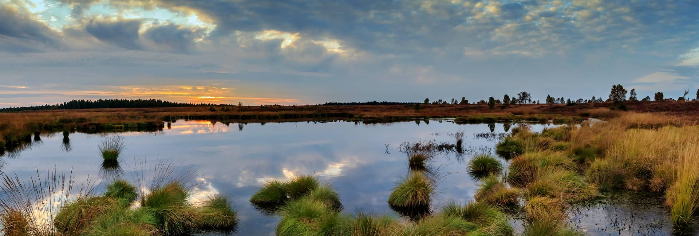

# Introduccion {#intro}

Definición del problema de investigación, alinear con proyecto SAMSARA

Objetivo Global:

Crear Sistema de Alerta y Monitoreo Satelital de Áreas de Relevancia Ambiental, identificará cambios en la estructura de la vegetación en humedales urbanos, turberas de Chiloé y el bosque y matorral esclerófilo de la región Metropolitana para ayudar a su preservación.

En desarrollo....