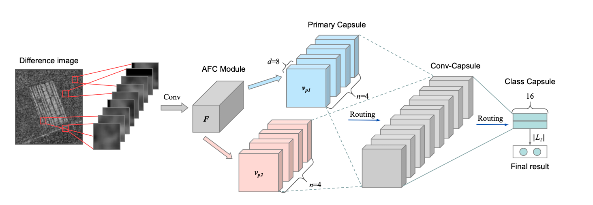

# Revisión Bibliográfica {#rev-biblio}

En está sección se registrará los aspectos generales de la revisión bibliográfica a modo de conocer el estado del arte en técnicas de identificación de cambios en imagenes satelitales utilizado redes neuronales convolucionales.

## Detección de Cambios con Imágenes Radar

### Ms-CapsNet

SAR Image Change Detection Based on Multiscale Capsule Network [@gao2021]

Resumen:

:   Los métodos tradicionales de detección de cambios en imágenes de radar de apertura sintética basados en redes neuronales convolucionales (CNN) se enfrentan a los **retos del ruido de moteado y la sensibilidad a la deformación**. Para mitigar estos problemas, propone una red de cápsulas multiescala (**Ms-CapsNet**) para extraer la información discriminativa entre los píxeles cambiados y los no cambiados. Por un lado, el módulo de cápsula multiescala se emplea para explotar la relación espacial de las características. Por lo tanto, se pueden conseguir propiedades equivariantes agregando las características de diferentes posiciones. Por otro lado, se ha diseñado un módulo de convolución de **fusión adaptativa (AFC)** para la Ms-CapsNet propuesta. Se pueden capturar características semánticas más altas para las cápsulas primarias. Las características extraídas por el módulo AFC mejoran significativamente la robustez frente al ruido de moteado. La eficacia de la Ms-CapsNet propuesta se verifica en tres conjuntos de datos SAR reales. Los experimentos de comparación con cuatro métodos de vanguardia demuestran la eficacia del método propuesto.

Index Terms:

:   Change detection, multiscale capsule network, synthetic aperture radar, deep learning.



Resultados y Análisis de Experimentos.


## Graph-Based Knowledge Supplement

Change Detection From Synthetic Aperture Radar Images via Graph-Based Knowledge Supplement Network [@wang2022]

Resumen:

:   La detección de cambios en las imágenes del radar de apertura sintética (SAR) es una tarea vital pero difícil en el campo del análisis de imágenes de teledetección. La mayoría de los trabajos anteriores adoptan un método auto-supervisado que utiliza muestras pseudo-etiquetadas para guiar el entrenamiento y las pruebas subsecuentes. Sin embargo, las redes profundas suelen requerir muchas muestras de alta calidad para la optimización de los parámetros. El ruido en las pseudo-etiquetas afecta inevitablemente al rendimiento final de la detección de cambios. Para resolver el problema, proponemos una red de complemento de conocimiento basada en **grafos (GKSNet)**. Para ser más específicos, extraemos información discriminatoria del conjunto de datos etiquetados existente como conocimiento adicional, para suprimir hasta cierto punto los efectos adversos de las muestras ruidosas. A continuación, diseñamos un módulo de transferencia de grafos para destilar información contextual de forma atenta desde el conjunto de datos etiquetados al conjunto de datos de destino, lo que permite salvar la correlación de características entre los conjuntos de datos. Para validar el método propuesto, realizamos amplios experimentos con cuatro conjuntos de datos de SAR, que demostraron la superioridad de la GKSNet propuesta en comparación con varias líneas de base del estado de la técnica.

Index Terms:

:   Change detection, graph dependency fusion, knowledge supplement network, synthetic aperture radar (SAR).

![Schematic illustration of the proposed GKSNet. The image features extracted by deep CNNs are projected into a graph representation. Then, the graph representations are transferred and fused via graph transfer module across different datasets. Finally, features from different graphs are fused via intergraph fusion module. Through feature fusion, the model exploits the common knowledge and bridge the feature correlation from different datasets. The obtained evolved features are capable of improving the change detection performance.](images/GKSNet.png)

## Detección de Cambios con Imágenes de alta resolución

### DASNet

DASNet: Dual attentive fully convolutional siamese networks for change detection in high-resolution satellite images[@chen_dasnet_2021]

Resumen:

:   La detección de cambios es una tarea básica del procesamiento de imágenes por teledetección. El objetivo de la investigación es identificar la información de cambio de interés y filtrar la información de cambio irrelevante como factores de interferencia. Recientemente, el aumento del aprendizaje profundo ha proporcionado nuevas herramientas para la detección de cambios, que han dado resultados impresionantes. Sin embargo, los métodos disponibles se centran principalmente en la información de diferencia entre las imágenes de teledetección multitemporal y carecen de robustez ante la información de pseudocambio. Para superar la falta de resistencia de los métodos actuales a los pseudocambios, en este trabajo proponemos un nuevo método, a saber, las redes siamesas totalmente convolucionales de atención dual (DASNet), para la detección de cambios en imágenes de alta resolución. A través del mecanismo de atención dual, se capturan las dependencias de largo alcance para obtener representaciones de características más discriminantes para mejorar el rendimiento de reconocimiento del modelo. Además, la muestra desequilibrada es un problema grave en la detección de cambios, es decir, las muestras sin cambios son mucho más abundantes que las muestras con cambios, lo que constituye una de las principales razones de los pseudocambios. Proponemos la pérdida contrastiva ponderada de doble margen para abordar este problema, castigando la atención a los pares de características sin cambios y aumentando la atención a los pares de características con cambios. Los resultados experimentales de nuestro método en el conjunto de datos de detección de cambios (CDD) y en el conjunto de datos de detección de cambios en edificios (BCDD) demuestran que, en comparación con otros métodos de referencia, el método propuesto consigue mejoras máximas del 2,9% y el 4,2%, respectivamente, en la puntuación F1. Nuestra implementación de PyTorch está disponible en <https://github.com/lehaifeng/DASNet>.

Index Terms:

:   Change detection, high-resolution images, dual attention, Siamese network, weighted double-margin contrastive loss.

```{r DASNet, echo=FALSE, out.width="100%", fig.align='center', fig.cap="DASNet: Dual attentive fully convolutional siamese networks for change detection in high-resolution satellite"}
knitr::include_graphics("images/esq-DASNet.jpeg")
```

## Links Por explorar

<https://courses.spatialthoughts.com/end-to-end-gee.html#module-4-change-detection>

-   <https://developers.google.com/earth-engine/tutorials/community/detecting-changes-in-sentinel-1-imagery-pt-1>
-   <https://www.youtube.com/results?search_query=change+detection+gee>
-   arquiología<https://code.earthengine.google.com/?scriptPath=users%2Fdenisberroeta%2FGEE_CIT_dbg%3Acc>

<https://www.youtube.com/watch?v=wDBcTOTAwOc>

-   <https://www.youtube.com/watch?v=5oONMB0UPWc>

-   <https://developers.google.cn/earth-engine/tutorials/tutorial_forest_01>

-   <https://appliedsciences.nasa.gov/join-mission/training/english/arset-using-google-earth-engine-land-monitoring-applications>

-   <https://appliedsciences.nasa.gov/sites/default/files/2021-06/GEE_Land_Part3.pdf>

-   <https://www.youtube.com/watch?v=KyjNhAvQS2s>

-   <https://paperswithcode.com/task/change-detection-for-remote-sensing-images>

<https://github.com/likyoo/Siam-NestedUNet>

contaminación

-   <https://appliedsciences.nasa.gov/join-mission/training/english/arset-high-resolution-no2-monitoring-space-tropomi>

Programa de la NASA <https://appliedsciences.nasa.gov/join-mission/training/english/arset-using-google-earth-engine-land-monitoring-applications>

<!-- radianearth -->

bigearth net

sentinel 1 Change detection no supervisado S1 si existe cambio algorimo global, unet - rmask

torch geo
